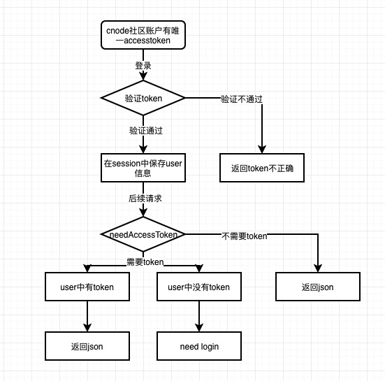

#

## 目录结构

  + views: 存放项目功能模块的页面，需要根据路由配置情况分割子级目录

  + config: 存放一些配置文件，比如第三方类库引用，路由配置等

  + store: 存放项目store相关的文件，包括数据获取的封装等

  + components: 存放非业务组件，或者在多个业务间都需要用到的功能组件

## 路由

### 什么是路由？

> 路由是用来区分一个网站不同功能模块的地址，浏览器通过访问同一站点下的不同路由，来访问网站的不同功能。同样路由也能让开发者区分返回的内容

### 如何做前端路由

> HTML5 API中的 history 能够让我们控制url跳转之后并不刷新页面，而是交给js代码进行相应的操作，在history api 出现之前，我们可以使用hash跳转来实现

### [react-router-dom](https://reacttraining.com/react-router/web/guides/quick-start)

  ```sh
  yarn add react-router-dom
  ```
### BrowserRouter
用<BrowserRouter> 组件包裹整个App系统后，就是通过html5的history来实现无刷新条件下的前端路由
  ```js
  // app.js
  import { BrowserRouter } from 'react-router-dom'
  import App from './views/App'
  <BrowserRouter>
    <App />
  </BrowserRouter>
  ```
  
### Route
Route 做的事情就是匹配相应的location中的地址，匹配成功后渲染对应的组件
  ```js
  //router.jsx
  export default () => [
    <Route path="/" render={() => <Redirect to="/list" />} exact />,
    <Route path="/" component={TopicList} exact />,
    <Route path="/detail" component={TopicDetail} exact />,
  ]
  ```
+ path：当location中的url改变后，会与Route中的path属性做匹配，path决定了与路由或者url相关的渲染效果。

+ exact: 如果有exact，只有url地址完全与path相同，才会匹配。如果没有exact属性，url的地址不完全相同，也会匹配

当Route组件与某一url匹配成功后，就会继续去渲染。那么什么属性决定去渲染哪个组件或者样式呢，Route的component、render、children决定渲染的内容。

+ component：该属性接受一个React组件，当url匹配成功，就会渲染该组件
+ render：func 该属性接受一个返回React Element的函数，当url匹配成功，渲染覆该返回的元素
+ children：与render相似，接受一个返回React Element的函数，但是不同点是，无论url与当前的Route的path匹配与否，children的内容始终会被渲染出来。

并且这3个属性所接受的方法或者组件，都会有3个参数
+ location
+ match
+ history


如果是组件，那么组件的props中会存在从Link传递过来的location，match以及history。
### Link
Link 决定的是如何在页面内改变url
  ```js
  //app.jsx
  render() {
    return [
      <div>
        <Link to="/">首页</Link>
        <Link to="/detail">详情页</Link>
      </div>,
      <Routes />,
    ]
  }
  ```


### Link 标签之外如何切换路由
```js
  // 通过context 获取 router
  static contextTypes = {
    router: PropTypes.object,
  }
  const { router } = this.context
  // router.history.replace('/user/info')
  // 通过html5新增API history.pushState() 更改路由
  router.history.push({
    pathname: '/user/login'
  })
```


## [Mobx](https://cn.mobx.js.org/)

Mobx 是flux的后起之秀，其以更简单的使用和更少的概念，让flux使用起来更加简单，
相比于Redux有mutation,action,reducer,dispatch等概念，Mobx更符合对一个store的增删改查。

下面我们来比较一下 redux和mobx

### redux

```js
// actionType
const ADD_ACTION = 'ADD'
// actionCreator
const add = (num) => {
  return {
    type: ADD_ACTION,
    num,
  }
}

const initState = {
  count: 0,
}
// reducer
const reducer = (state = initState, action) => {
  switch(action.type){
    case ADD_ACTION:
      return Object.assign({}, state, {
        count: state.count + action.num
      })
    default:
      return state
  }
}
// store
const reduxStore = createStore(reducer)
// dispatch
reduxStore.dispatch(add(1))
```

### mobx

```js
import { objservable, action } from 'mobx'

const mobxStore = observable({
  count: 0,
  add: action((num) => {
    this.count += num
  })
})

mobxStore.add(1)
```

### mobx会用到 ES6的 Decorator(装饰器)4

#### 什么是装饰器

> 如果想了解decorator可以看[阮一峰老师的文章](http://es6.ruanyifeng.com/#docs/decorator)

#### babel如何配置才能支持装饰器

> [babel 如何启用装饰器语法](https://cn.mobx.js.org/best/decorators.html#%E5%90%AF%E7%94%A8%E8%A3%85%E9%A5%B0%E5%99%A8%E8%AF%AD%E6%B3%95)

> 对于 babel 7, 参见 [issue 1352](https://github.com/mobxjs/mobx/issues/1352) 来查看设置示例

```sh
 yarn add @babel/plugin-proposal-decorators @babel/plugin-proposal-class-properties --dev
```

```sh
{
    "presets": ["@babel/preset-env"],
    "plugins": [
        ["@babel/plugin-proposal-decorators", { "legacy": true }],
        ["@babel/plugin-proposal-class-properties", { "loose": true }]
    ]
}
```

### mobx 快速入门

#### [@observable](https://cn.mobx.js.org/refguide/observable-decorator.html#observable) 将 state 标记为 可观察状态


```js
import { observable, computed } from "mobx";

class OrderLine {
    @observable price = 0;
    @observable amount = 1;

    @computed get total() {
        return this.price * this.amount;
    }
}
```

#### [@computed](https://cn.mobx.js.org/refguide/computed-decorator.html#computed) 计算值

根据现有的状态或其它计算值衍生出的值

如果已经[启用 decorators](https://cn.mobx.js.org/best/decorators.html) 的话，可以在任意类属性的 [getter](https://developer.mozilla.org/zh-CN/docs/Web/JavaScript/Reference/Functions/get) 上使用 @computed 装饰器来声明式的创建计算属性

```js
import {observable, computed} from "mobx";

class OrderLine {
    @observable price = 0;
    @observable amount = 1;

    constructor(price) {
        this.price = price;
    }

    @computed get total() {
        return this.price * this.amount;
    }
}
```

#### [@observer](https://cn.mobx.js.org/refguide/observer-component.html#observer) 观察者 && [@inject(stores)](https://cn.mobx.js.org/refguide/observer-component.html#%E4%BD%BF%E7%94%A8-inject-%E5%B0%86%E7%BB%84%E4%BB%B6%E8%BF%9E%E6%8E%A5%E5%88%B0%E6%8F%90%E4%BE%9B%E7%9A%84-stores) 注入store到当前组件

> observer 函数/装饰器可以用来将 React 组件转变成响应式组件
> 它用 mobx.autorun 包装了组件的 render 函数以确保任何组件渲染中使用的 **数据变化时** 都可以 **强制刷新组件**

> mobx-react 包还提供了 Provider 组件，它使用了 React 的上下文(context)机制，可以用来向下传递 stores
> 要连接到这些 stores，需要传递一个 stores 名称的列表给 inject，这使得 stores 可以作为组件的 props 使用

```js
<Provider appState={appState}>
  <Component />
</Provider>

@inject('appState') @observer
class TopicList extends React.Component {

  handleChange = (e) => {
    const { appState } = this.props
    appState.changeName(e.target.value)
  }

  render() {
    const { appState } = this.props
    return (
      <div>
        <input type="text" onChange={this.handleChange} />
        <div>{ appState.msg }</div>
      </div>
    )
  }
}
```

#### [autorun](https://cn.mobx.js.org/refguide/autorun.html#autorun)

经验法则：如果你有一个函数应该自动运行，但不会产生一个新的值，请使用autorun。 其余情况都应该使用 computed

```js
autorun(() => {
  console.log(appState.msg)
})
```

## cnode API代理实现

+ handle-login.js 代理 longin 请求

+ proxy.js 代理剩余请求




